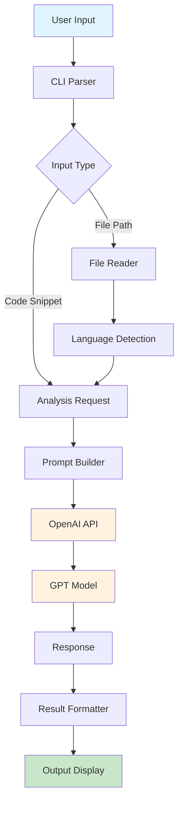
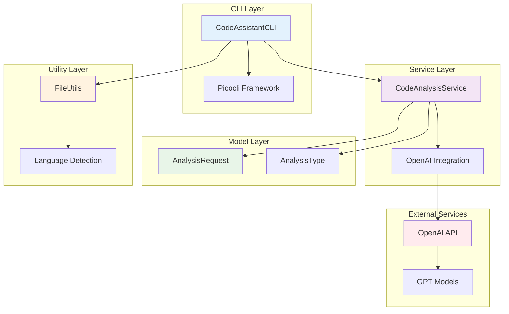
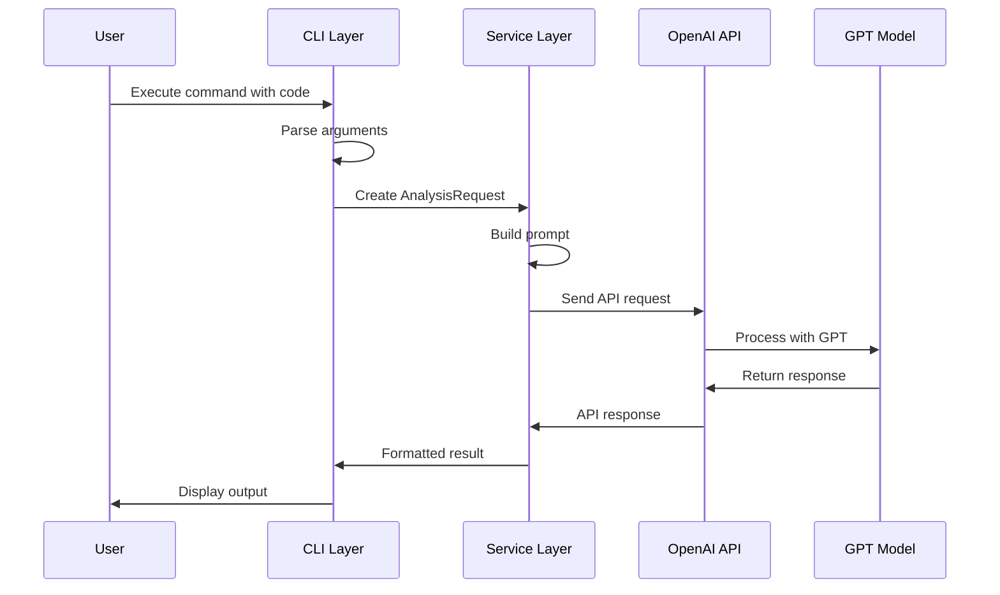
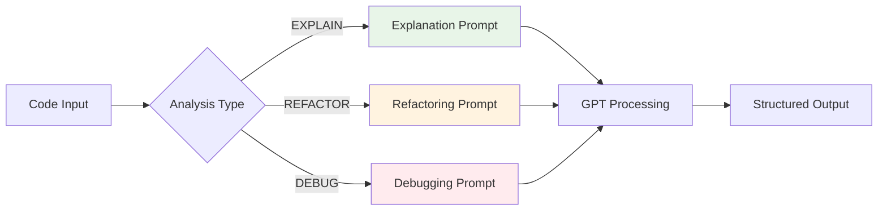
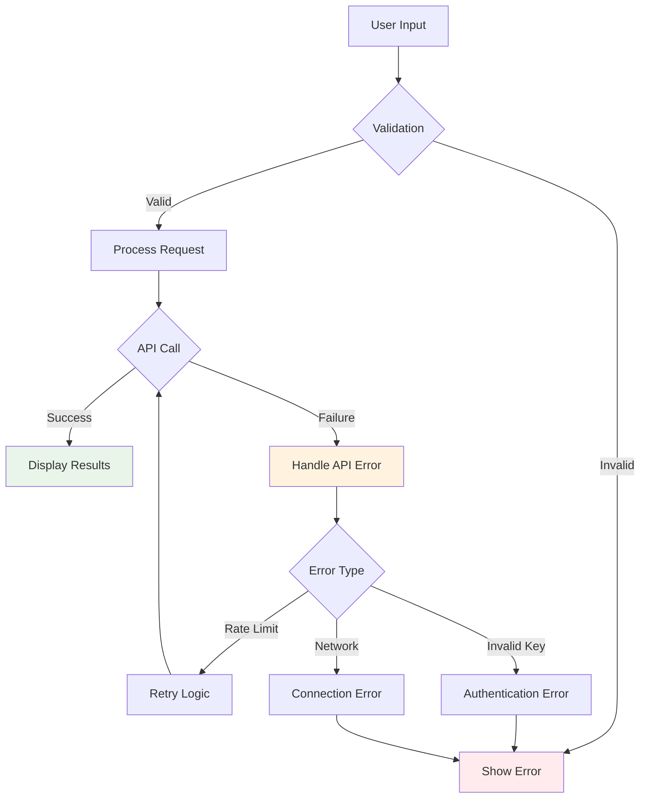
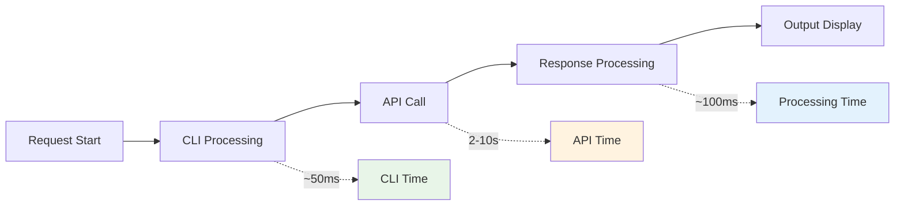
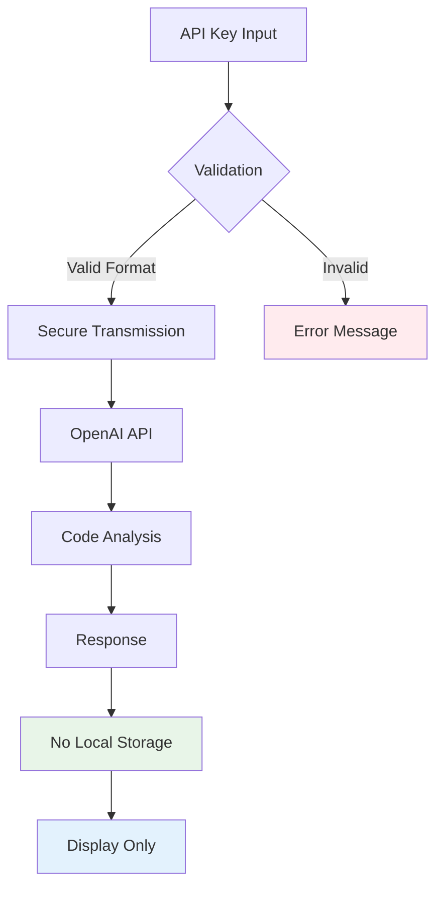

# Code Assistant CLI - System Diagram

## 🔄 System Flow

## 🏗️ Component Architecture

## 📊 Data Flow Sequence

## 🔧 Analysis Types

## 🛡️ Error Handling

## 📈 Performance Metrics

## 🔐 Security Flow

---

These diagrams provide a comprehensive view of the Code Assistant CLI system architecture, data flow, and security considerations. 